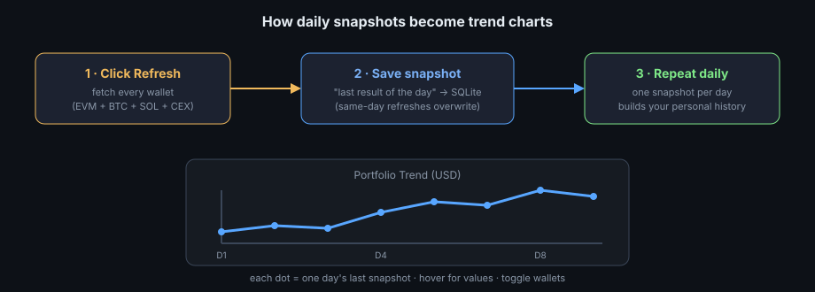
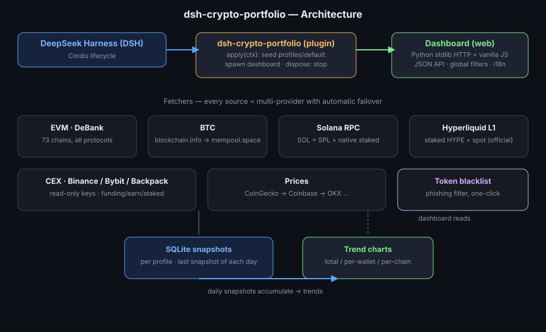

# dsh-crypto-portfolio

[English](README.md) | 中文

免费、100% 自托管的 [DeepSeek Harness](https://github.com/deepseek-ai/deepseek-harness)（DSH）插件：把**链上与 CEX 资产**统一到一张自包含的 Web 仪表盘上。

> 非官方项目，由社区成员独立开发和维护，与 DeepSeek 官方无关。

---

## 为什么写它 / 痛点

我写它是因为痛点是真的疼。

### 一、我的钱散在七个地方，想看个总数要开六个页面

EVM 资产在 DeBank、SOL 和质押在 Solana 链上、BTC 在区块浏览器、还有 Binance / Bybit / Backpack 三个交易所各一套 App。每次想看"我到底有多少钱"，都得打开 DeBank 翻几个链、再去查质押、最后挨个登录三个交易所——手一抖还容易看漏钱包。

**这个插件把这些全拼到一张图上。**

### 二、链上浏览器看不到的"隐形资产"

有些钱是真的看不见：Solana 的原生质押账户（`getParsedStakeAccounts` 会漏）、Hyperliquid L1 的质押 HYPE 和现货、交易所的理财/资金账户——这些都不是普通 SPL/ERC20 代币，普通工具根本读不到。

**这个插件专门把它们挖出来，全部计价进总资产**——包括上面的账户里质押的 12.1 SOL、Hyperliquid 上质押的约 318 枚 HYPE。

### 三、空气币和钓鱼代币把数字搞得虚高

DeBank 会把一堆假代币也列出来，比如 ETHG 这种**价格被操纵的钓鱼币**，一个账户能虚报出 57 万美元。

**一键拉黑**：你点掉的每一笔都会从总额、趋势、历史快照里同步剔除。

### 四、我想知道"上周这时候我到底有多少钱"

没有历史就没有安全感。

**每次刷新自动保存当天最后一次快照**（SQLite，按天去重）；日子久了，就长出一条属于你自己的资产趋势线：



---

## 它做了什么

- **一个 DSH 插件，拉起一个零依赖的 Web 仪表盘。** 没有框架、没有 CDN，Python 标准库 + 原生 JS。
- **覆盖 BTC / EVM / Solana / Hyperliquid L1 / CEX。** DeBank 全 73 条链、BTC 双地址（P2SH + P2TR）、Solana 原生质押、Hyperliquid 官方 API（质押 HYPE + 现货 + 永续权益）、三家交易所只读 key（命名 `<交易所>_read`）。
- **全局筛选。** 分类（BTC / EVM / Solana / CEX）、钱包、网络三个下拉作用于所有面板——总额、钱包占比饼图、趋势、网络分布、代币表一起联动。
- **多 API 源自动切换。** 每个数据源配了多个 provider（价格：CoinGecko → Binance → Coinbase → OKX；BTC：blockchain.info → mempool.space；Solana RPC 多节点；Hyperliquid 双端点），挂了自动切下一个，并记住最近能用的。
- **多 Profile 配置隔离。** `default` Profile 内置公开模板钱包（vitalik.eth、创世 BTC、公开 SOL）与空 key；你的私人钱包和 key 放在独立命名的 Profile 里，拥有各自的快照历史。
- **中英双语界面，默认英文。**


架构长这样——每个方框都是一条真实的数据管线：



## 与 DSH 的集成方式

不是套壳，是真插件：

- 声明 `dsh.bundle` manifest（`cordis.patch.yml`），`dsh plugin add` 直接安装。
- `apply(ctx)` 接入 Cordis 生命周期：首次运行用公开模板生成用户本地的 `profiles/default`，以子进程拉起仪表盘，`ctx.on('dispose')` 时优雅停掉。
- 除 Web UI 外还暴露 JSON API（`GET /api/refresh`、`/api/history`、`/api/tokens` 等），agent 可直接调用。

## 隐私声明（重要）

本仓库**不含任何私钥、私人钱包或余额**——`tracker/config.py` 只有 `WALLETS = []` 和空 key。所有私人配置都存放在本地 git-ignored 的 `profiles/` 里。你可以放心 clone、放心 review、放心跑。

## 安装

依赖：Python 3.9+（`requests`；`pynacl` 已随 `vendor/` 打包）。

```sh
# 在 DSH 源码目录
dsh plugin --profile demo add /path/to/dsh-crypto-portfolio
dsh --profile demo
# 仪表盘地址 http://127.0.0.1:8080（可用 PORTFOLIO_PORT 覆盖）
```

或脱离 DSH 独立运行：

```sh
python3 run.py --init-template --port 8080   # 用公开模板初始化 profiles/default
```

## 目录结构

```
profiles/default/   sources.json + wallets.json（公开模板，自动生成）
templates/          公开示例配置（无任何密钥）
tracker/            后端抓取器（debank/btc/solana/hyperliquid/cex/prices）
static/             Web 仪表盘（原生 JS，零外部依赖）
run.py / fetch.py   Web 服务 / 命令行快照
```

## 许可证

MIT — 见 [LICENSE](LICENSE)。
