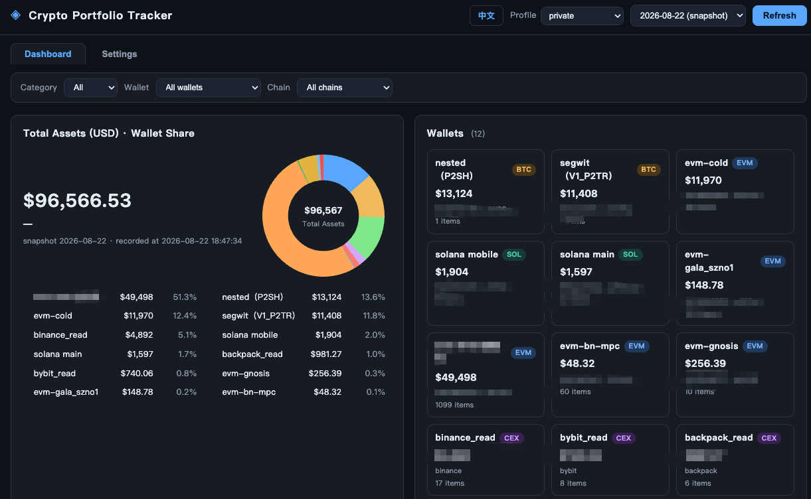

# dsh-crypto-portfolio

[English](README.md) | 中文

面向 [DeepSeek Harness](https://github.com/deepseek-ai/deepseek-harness)（DSH）的加密货币组合追踪插件。

跨 **BTC / EVM / Solana / Hyperliquid L1 / CEX（Binance · Bybit · Backpack）** 追踪钱包，
支持多 API 源自动切换、每日快照与趋势图——以 Cordis 插件形式启动的自包含 Web 仪表盘。



## 功能

- **钱包类型**：BTC（P2SH/P2TR）、EVM（DeBank 全链）、Solana（公共 RPC：SOL + SPL + 原生质押 SOL）、
  Hyperliquid L1（官方 API：质押 HYPE + 现货）、CEX 账户（只读 key，命名为 `<交易所>_read`）。
- **数据源可配置**：所有 API 的 URL/key 都在每个 Profile 的 JSON 配置中（`profiles/<名称>/`）。
  每个数据源支持多个 provider，**失败自动切换**（记住最近成功者优先）。
- **多 Profile**：每个命名 Profile 拥有独立的 sources / wallets / blacklist / 快照历史。
  `default` Profile 内置公开示例钱包（vitalik.eth、创世 BTC、公开 SOL）与空 key。
- **仪表盘**：全局筛选（分类 BTC/EVM/Solana/CEX、钱包、网络）、钱包占比饼图、
  每日趋势图、网络分布、一键拉黑代币表、中英文界面（默认英文）。
- **快照**：每次刷新保存当天最后一次结果（SQLite），历史积累形成趋势图。

## 隐私

本仓库**不含任何私人钱包、API key 或余额**。私人配置位于用户本地
（`profiles/<名称>/`，已被 git 忽略），绝不会进入本仓库。插件首次运行会从
`templates/`（公开地址、空 key）生成 `profiles/default`。

## 安装

依赖：Python 3.9+（`requests`；`pynacl` 已随 `vendor/` 打包）。

```sh
# 在 DSH 源码目录
dsh plugin --profile demo add /path/to/dsh-crypto-portfolio
dsh --profile demo
# 仪表盘地址 http://127.0.0.1:8080（可用 PORTFOLIO_PORT 覆盖）
```

或脱离 DSH 独立运行：

```sh
python3 run.py --init-template --port 8080   # 用公开模板初始化 profiles/default
```

## 目录结构

```
profiles/default/   sources.json + wallets.json（公开模板，自动生成）
templates/          公开示例配置（无任何密钥）
tracker/            后端抓取器（debank/btc/solana/hyperliquid/cex/prices）
static/             Web 仪表盘（原生 JS，零外部依赖）
run.py / fetch.py   Web 服务 / 命令行快照
```

## 许可证

MIT — 见 [LICENSE](LICENSE)。
